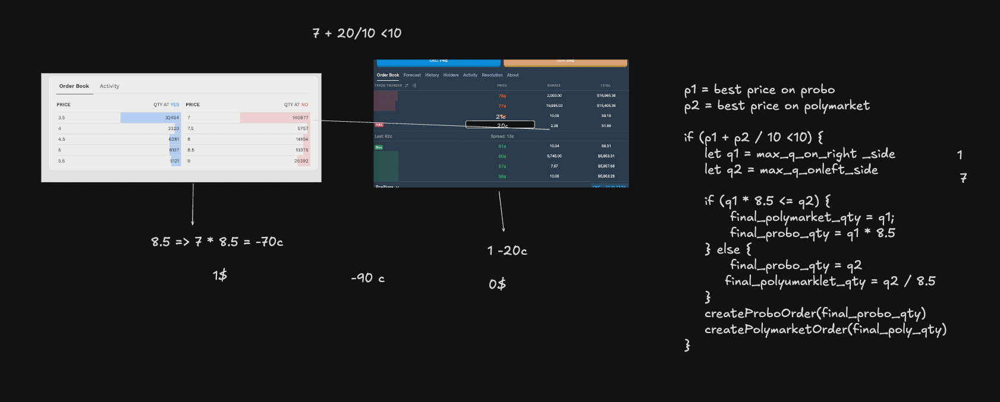

# Probo-Polymarket Arbitrage Bot



This project implements an arbitrage bot that identifies and executes trading opportunities between Probo and Polymarket prediction markets. The bot monitors price differences between the same markets on both platforms and executes trades when profitable arbitrage opportunities are found.

## Overview

The bot performs the following functions:
- Fetches order book depth from both Probo and Polymarket
- Identifies arbitrage opportunities based on price differences
- Executes trades when profitable opportunities are found
- Handles currency conversion between INR and USD

## Prerequisites

- Node.js/Bun runtime
- TypeScript
- Access to Probo API
- Access to Polymarket API
- Ethereum wallet with private key
- USDC tokens for trading

## Environment Variables

1. Copy the example environment file:
```bash
cp .env.example .env
```

2. Fill in your credentials in the `.env` file. See `.env.example` for required variables.

## Installation

1. Clone the repository
2. Install dependencies:
```bash
bun install
```

## Project Structure

- `index.ts` - Main arbitrage logic and execution
- `probo.ts` - Probo API integration
- `polymarket.ts` - Polymarket API integration
- `types.ts` - TypeScript type definitions
- `clob-client/` - Polymarket CLOB client implementation

## Configuration

The bot uses the following constants that can be adjusted in `index.ts`:
- `PROBO_TOKEN_ID` - Market ID on Probo
- `POLYMARKET_TOKEN_ID` - Market ID on Polymarket
- `DOLLAR_PRICE` - USD/INR conversion rate
- `EXPECTED_ARB_PERCENT` - Minimum arbitrage percentage to execute trades

## Usage

Run the bot:
```bash
bun run index.ts
```

The bot will:
1. Fetch order book depth from both platforms
2. Calculate potential arbitrage opportunities
3. Execute trades if profitable opportunities are found
4. Log all actions and results

## Trading Logic

The arbitrage bot:
- Monitors sell orders on both platforms
- Calculates potential profit after considering:
  - Price differences
  - Currency conversion (INR/USD)
  - Minimum profit threshold
- Executes trades when profit exceeds the threshold
- Handles order size calculations to maximize profit

## Security Notes

- Never commit your private keys or API secrets
- Use environment variables for sensitive data
- Monitor your trades and balances regularly
- Start with small trade sizes for testing

## Dependencies

- axios - HTTP client
- ethers - Ethereum interaction
- TypeScript - Type safety
- Bun - Runtime environment

## License

[Add your license information here]

